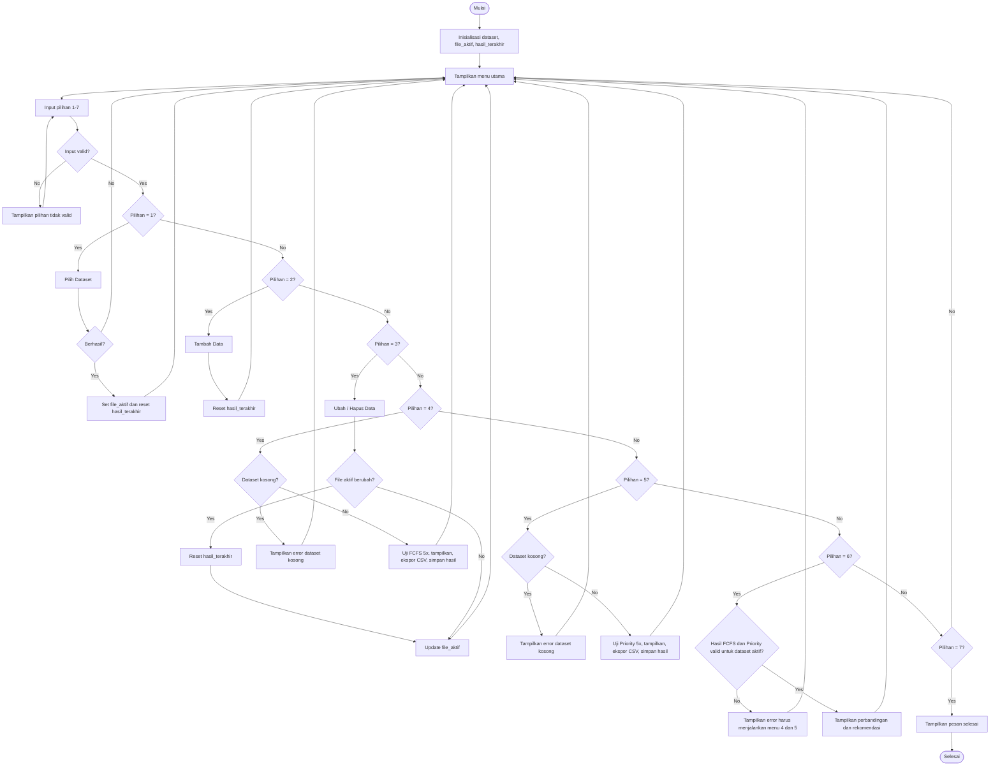
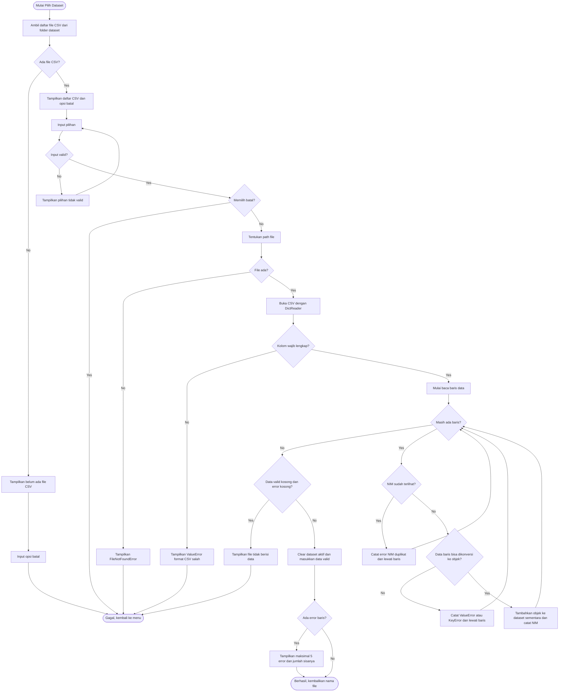
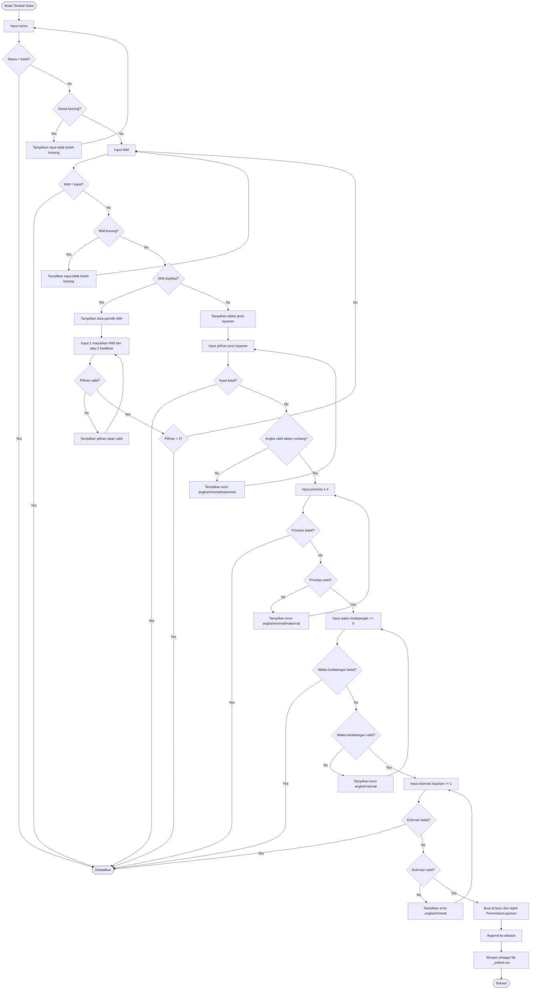
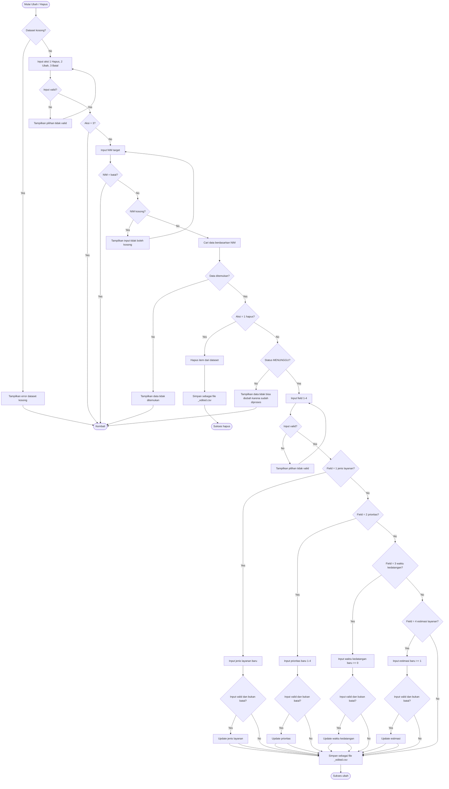
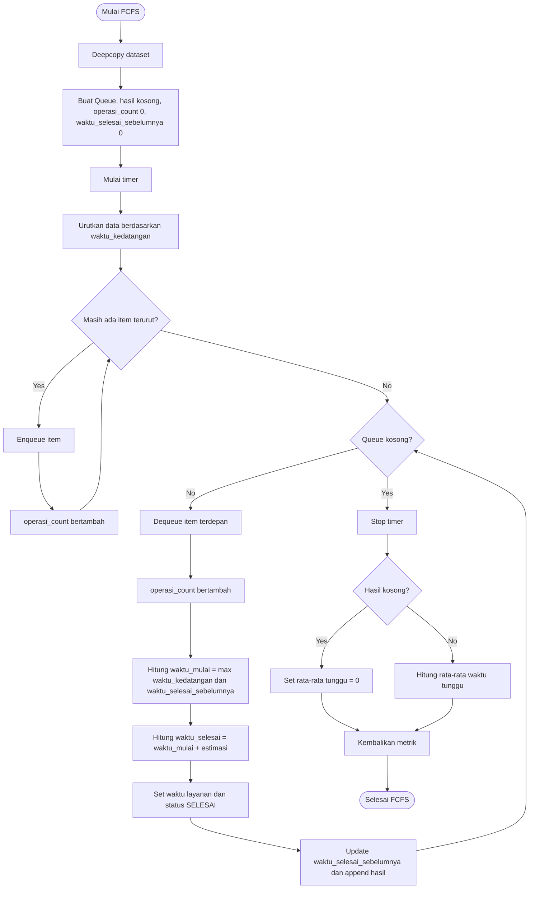
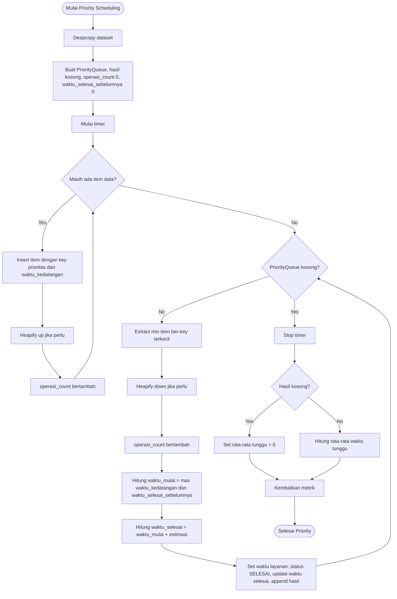
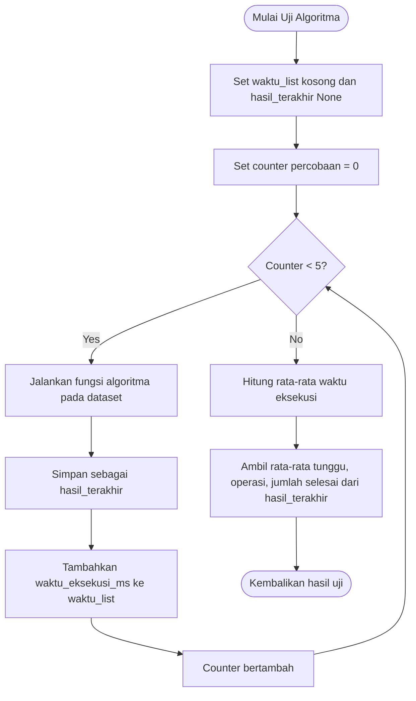
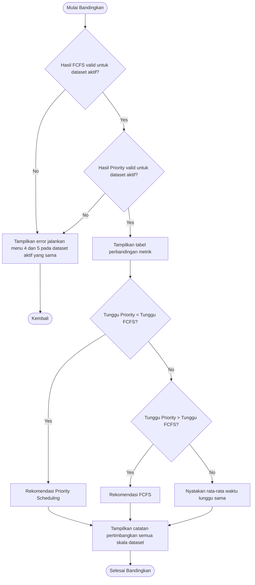

# Analisis Algoritma dan Flowchart Sistem Antrean Pelayanan Akademik

## 1. Ringkasan Cara Kerja Program

Program adalah aplikasi terminal untuk mengelola antrean permintaan layanan akademik mahasiswa. Data permintaan disimpan dalam file CSV di folder `dataset/`, dimuat ke list `dataset`, lalu dapat ditambah, diubah, dihapus, diproses dengan FCFS, diproses dengan Priority Scheduling, dan dibandingkan hasilnya.

Struktur utama program:

- `main.py` mengatur menu, input pengguna, CRUD data, pemilihan dataset, pemanggilan algoritma, pengujian 5 kali, ekspor hasil, dan perbandingan.
- `dataset_io.py` membaca/menulis dataset CSV, memvalidasi kolom wajib, dan melewati baris bermasalah.
- `models.py` mendefinisikan objek `PermintaanLayanan` dan daftar jenis layanan.
- `struktur_data.py` mendefinisikan `Queue` berbasis `deque` dan `PriorityQueue` berbasis min-heap manual.
- `algoritma.py` menjalankan FCFS dan Priority Scheduling, menghitung waktu mulai, waktu selesai, status selesai, jumlah operasi, waktu eksekusi, dan rata-rata waktu tunggu.
- `pengujian.py` menjalankan setiap algoritma 5 kali, menampilkan hasil, membandingkan metrik, memberi rekomendasi otomatis, dan mengekspor rekap ke CSV.

Alur umum program:

1. Program menampilkan menu utama berulang sampai pengguna memilih keluar.
2. Input menu divalidasi hanya menerima angka `1` sampai `7`.
3. Pengguna dapat memilih dataset CSV dari folder `dataset/`.
4. Dataset yang valid dimuat; baris dengan NIM duplikat di file atau nilai yang tidak dapat dikonversi dilewati.
5. Pengguna dapat menambah, mengubah, atau menghapus data. Perubahan disimpan sebagai file baru berakhiran `_edited.csv` sehingga file asli tidak diubah.
6. FCFS dan Priority Scheduling masing-masing diuji otomatis 5 kali.
7. Perbandingan hanya dapat dilakukan jika kedua algoritma sudah dijalankan pada dataset aktif yang sama.
8. Program selesai saat pengguna memilih menu `7`.

## 2. Algoritma/Pseudocode per Fitur

### 2.1 Menu Utama

```text
ALGORITMA Menu_Utama
1. Inisialisasi dataset = list kosong.
2. Inisialisasi file_aktif = None.
3. Inisialisasi hasil_terakhir untuk FCFS dan Priority = None.
4. Selama True:
   a. Tampilkan menu utama dan informasi jumlah data serta dataset aktif.
   b. Baca pilihan menu dengan validasi 1 sampai 7.
   c. Jika pilihan = 1:
      - Jalankan Pilih_Dataset.
      - Jika berhasil, set file_aktif dan reset hasil_terakhir.
   d. Jika pilihan = 2:
      - Jika belum ada dataset aktif dan dataset kosong, tampilkan informasi bahwa data akan disimpan sebagai dataset custom.
      - Jalankan Tambah_Data.
      - Reset hasil_terakhir.
   e. Jika pilihan = 3:
      - Jalankan Ubah_Hapus_Data.
      - Jika nama file berubah, reset hasil_terakhir.
   f. Jika pilihan = 4:
      - Jika dataset kosong, tampilkan error dan kembali ke menu.
      - Uji FCFS sebanyak 5 kali.
      - Tampilkan hasil dan ekspor ke CSV.
      - Simpan hasil FCFS terakhir beserta nama dataset aktif.
   g. Jika pilihan = 5:
      - Jika dataset kosong, tampilkan error dan kembali ke menu.
      - Uji Priority Scheduling sebanyak 5 kali.
      - Tampilkan hasil dan ekspor ke CSV.
      - Simpan hasil Priority terakhir beserta nama dataset aktif.
   h. Jika pilihan = 6:
      - Cek apakah hasil FCFS dan Priority ada serta berasal dari dataset aktif yang sama.
      - Jika belum lengkap, tampilkan error.
      - Jika lengkap, tampilkan perbandingan dan rekomendasi.
   i. Jika pilihan = 7:
      - Tampilkan pesan selesai.
      - Hentikan perulangan.
```

### 2.2 Pemilihan dan Pembacaan Dataset CSV

```text
ALGORITMA Pilih_Dataset
1. Ambil daftar file .csv dari folder dataset/.
2. Jika folder tidak ada atau tidak ada file CSV:
   a. Tampilkan pesan belum ada CSV.
   b. Sediakan hanya opsi batal.
   c. Kembalikan gagal.
3. Tampilkan daftar file CSV dan opsi batal.
4. Baca pilihan valid.
5. Jika pengguna memilih batal, kembalikan gagal.
6. Tentukan path file berdasarkan pilihan.
7. Coba baca CSV:
   a. Jika file tidak ditemukan, tampilkan error dan kembalikan gagal.
   b. Jika format kolom wajib tidak sesuai, tampilkan error dan kembalikan gagal.
8. Saat membaca baris CSV:
   a. Jika NIM sudah pernah muncul di file, catat error baris dan lewati.
   b. Jika pembuatan objek gagal karena nilai tidak valid atau kolom hilang, catat error baris dan lewati.
   c. Jika valid, masukkan objek ke dataset.
9. Jika data kosong dan tidak ada error, tampilkan pesan file kosong dan kembalikan gagal.
10. Kosongkan dataset aktif lama.
11. Masukkan data valid ke dataset aktif.
12. Tampilkan jumlah data berhasil dimuat.
13. Jika ada error baris, tampilkan maksimal 5 error pertama dan jumlah sisanya.
14. Kembalikan berhasil dan nama file.
```

### 2.3 Tambah Data

```text
ALGORITMA Tambah_Data
1. Tampilkan form tambah data dan instruksi bahwa input 'batal' membatalkan proses.
2. Baca nama:
   a. Jika 'batal', kembali tanpa perubahan.
   b. Jika kosong, minta ulang.
3. Ulangi input NIM:
   a. Baca NIM.
   b. Jika 'batal', kembali tanpa perubahan.
   c. Jika kosong, minta ulang.
   d. Cek duplikat NIM pada dataset aktif.
   e. Jika tidak duplikat, keluar dari loop NIM.
   f. Jika duplikat, tampilkan data pemilik NIM.
   g. Minta pilihan: masukkan NIM lain atau batalkan.
   h. Jika batalkan, kembali tanpa perubahan.
4. Tampilkan daftar jenis layanan.
5. Baca pilihan jenis layanan dengan batas 1 sampai jumlah jenis layanan.
6. Jika 'batal', kembali tanpa perubahan.
7. Baca prioritas dengan batas 1 sampai 4.
8. Baca waktu kedatangan dengan batas minimal 0.
9. Baca estimasi waktu layanan dengan batas minimal 1.
10. Buat id baru = id terbesar di dataset + 1, atau 1 jika dataset kosong.
11. Buat objek PermintaanLayanan baru.
12. Tambahkan objek ke dataset.
13. Simpan dataset sebagai file berakhiran _edited.csv.
14. Tampilkan pesan sukses dan kembalikan nama file baru.
```

### 2.4 Ubah atau Hapus Data

```text
ALGORITMA Ubah_Hapus_Data
1. Jika dataset kosong:
   a. Tampilkan error dataset kosong.
   b. Kembali tanpa perubahan.
2. Minta aksi: 1 = Hapus, 2 = Ubah, 3 = Batal.
3. Jika aksi batal, kembali tanpa perubahan.
4. Minta NIM target.
5. Jika input 'batal', kembali tanpa perubahan.
6. Cari data berdasarkan NIM.
7. Jika data tidak ditemukan, tampilkan error dan kembali tanpa perubahan.
8. Jika aksi = Hapus:
   a. Hapus item dari dataset.
   b. Simpan dataset sebagai file _edited.csv.
   c. Tampilkan pesan sukses.
   d. Kembalikan nama file baru.
9. Jika aksi = Ubah:
   a. Jika status item bukan MENUNGGU, tampilkan error dan kembali tanpa perubahan.
   b. Tampilkan pilihan field yang dapat diubah.
   c. Jika field jenis layanan, pilih indeks jenis layanan baru.
   d. Jika field prioritas, input angka 1 sampai 4.
   e. Jika field waktu kedatangan, input angka minimal 0.
   f. Jika field estimasi layanan, input angka minimal 1.
   g. Jika input field bernilai 'batal', nilai tidak diubah tetapi program tetap menyimpan dataset.
   h. Simpan dataset sebagai file _edited.csv.
   i. Tampilkan pesan sukses.
   j. Kembalikan nama file baru.
```

### 2.5 FCFS

```text
ALGORITMA FCFS
1. Salin dataset agar data asli tidak berubah.
2. Buat Queue kosong.
3. Buat list hasil kosong.
4. Set operasi_count = 0.
5. Set waktu_selesai_sebelumnya = 0.
6. Mulai hitung waktu eksekusi.
7. Urutkan data berdasarkan waktu_kedatangan menaik.
8. Untuk setiap item terurut:
   a. Masukkan item ke Queue.
   b. Tambah operasi_count.
9. Selama Queue tidak kosong:
   a. Ambil item paling depan.
   b. Tambah operasi_count.
   c. Hitung waktu_mulai = maksimum(waktu_kedatangan item, waktu_selesai_sebelumnya).
   d. Hitung waktu_selesai = waktu_mulai + estimasi_waktu_layanan.
   e. Isi waktu_mulai_layanan dan waktu_selesai_layanan.
   f. Ubah status menjadi SELESAI.
   g. Set waktu_selesai_sebelumnya = waktu_selesai.
   h. Tambahkan item ke hasil.
10. Hentikan hitung waktu eksekusi.
11. Hitung rata-rata waktu tunggu; jika hasil kosong, rata-rata = 0.
12. Kembalikan hasil, waktu eksekusi ms, jumlah operasi, rata-rata tunggu, dan jumlah selesai.
```

### 2.6 Priority Scheduling

```text
ALGORITMA Priority_Scheduling
1. Salin dataset agar data asli tidak berubah.
2. Buat PriorityQueue kosong.
3. Buat list hasil kosong.
4. Set operasi_count = 0.
5. Set waktu_selesai_sebelumnya = 0.
6. Mulai hitung waktu eksekusi.
7. Untuk setiap item pada data:
   a. Masukkan item ke PriorityQueue dengan key = (prioritas, waktu_kedatangan).
   b. Tambah operasi_count.
8. Selama PriorityQueue tidak kosong:
   a. Ambil item dengan key terkecil.
   b. Tambah operasi_count.
   c. Hitung waktu_mulai = maksimum(waktu_kedatangan item, waktu_selesai_sebelumnya).
   d. Hitung waktu_selesai = waktu_mulai + estimasi_waktu_layanan.
   e. Isi waktu_mulai_layanan dan waktu_selesai_layanan.
   f. Ubah status menjadi SELESAI.
   g. Set waktu_selesai_sebelumnya = waktu_selesai.
   h. Tambahkan item ke hasil.
9. Hentikan hitung waktu eksekusi.
10. Hitung rata-rata waktu tunggu; jika hasil kosong, rata-rata = 0.
11. Kembalikan hasil, waktu eksekusi ms, jumlah operasi, rata-rata tunggu, dan jumlah selesai.
```

### 2.7 Pengujian 5 Kali

```text
ALGORITMA Uji_Algoritma
1. Buat list waktu eksekusi kosong.
2. Set hasil_terakhir = None.
3. Ulangi sebanyak 5 kali:
   a. Jalankan fungsi algoritma pada dataset.
   b. Simpan hasil sebagai hasil_terakhir.
   c. Tambahkan waktu_eksekusi_ms ke list waktu.
4. Hitung rata-rata waktu eksekusi dari 5 percobaan.
5. Ambil rata-rata waktu tunggu, jumlah operasi, dan jumlah selesai dari hasil terakhir.
6. Kembalikan daftar waktu percobaan dan metrik ringkasan.
```

### 2.8 Perbandingan Hasil dan Rekomendasi

```text
ALGORITMA Bandingkan_Hasil
1. Pastikan hasil FCFS ada dan nama dataset hasil FCFS sama dengan dataset aktif.
2. Pastikan hasil Priority ada dan nama dataset hasil Priority sama dengan dataset aktif.
3. Jika salah satu tidak terpenuhi, tampilkan error dan kembali ke menu.
4. Tampilkan tabel berisi:
   a. Rata-rata waktu eksekusi.
   b. Rata-rata waktu tunggu.
   c. Jumlah operasi struktur data.
   d. Jumlah layanan selesai.
5. Jika rata-rata waktu tunggu Priority lebih kecil dari FCFS:
   a. Rekomendasikan Priority Scheduling.
6. Jika tidak, cek apakah rata-rata waktu tunggu Priority lebih besar dari FCFS:
   a. Jika ya, rekomendasikan FCFS.
   b. Jika tidak, nyatakan kedua algoritma memiliki rata-rata waktu tunggu sama.
7. Tampilkan catatan bahwa rekomendasi final sebaiknya mempertimbangkan seluruh skala dataset.
```

## 3. Flowchart Mermaid per Fitur

### 3.1 Flowchart Menu Utama



### 3.2 Flowchart Pemilihan dan Pembacaan CSV



### 3.3 Flowchart Tambah Data



### 3.4 Flowchart Ubah atau Hapus Data



### 3.5 Flowchart FCFS



### 3.6 Flowchart Priority Scheduling



### 3.7 Flowchart Pengujian 5 Kali



### 3.8 Flowchart Perbandingan dan Rekomendasi



## 4. Penjelasan Keputusan Penting pada Flowchart

1. **Validasi input menu**  
   Semua menu menggunakan `input_pilihan_menu`, sehingga input yang tidak ada dalam pilihan valid akan ditolak dan diminta ulang.

2. **Menu bercabang banyak dibuat berantai**  
   Menu utama tidak digambar sebagai satu decision dengan banyak cabang. Flowchart memeriksa berurutan: pilihan 1, jika tidak lanjut pilihan 2, dan seterusnya sampai pilihan 7.

3. **Dataset kosong sebelum menjalankan algoritma**  
   FCFS dan Priority Scheduling hanya dijalankan jika dataset tidak kosong. Jika kosong, program menampilkan pesan agar pengguna memilih dataset terlebih dahulu.

4. **Validasi file CSV**  
   Pembacaan CSV memeriksa keberadaan file, kelengkapan kolom wajib, NIM duplikat dalam satu file, dan error konversi data ke tipe integer pada model.

5. **NIM duplikat saat tambah data**  
   Saat input NIM, program mencari NIM yang sama di dataset aktif. Jika ditemukan, pengguna hanya punya dua pilihan: memasukkan NIM lain atau membatalkan penambahan.

6. **Ubah data hanya untuk status MENUNGGU**  
   Data tidak boleh diubah jika statusnya bukan `MENUNGGU`. Namun pada alur program utama, algoritma memakai `deepcopy`, sehingga dataset asli biasanya tetap `MENUNGGU` setelah pengujian.

7. **FCFS berdasarkan waktu kedatangan**  
   FCFS memasukkan data ke queue setelah diurutkan berdasarkan `waktu_kedatangan`, lalu memproses sesuai urutan antrean.

8. **Priority Scheduling berdasarkan prioritas dan waktu kedatangan**  
   Priority Queue memakai key `(prioritas, waktu_kedatangan)`. Nilai prioritas lebih kecil diproses lebih dulu; jika prioritas sama, waktu kedatangan lebih kecil diproses lebih dulu.

9. **Perbandingan harus dari dataset aktif yang sama**  
   Program menyimpan nama dataset saat FCFS dan Priority dijalankan. Perbandingan ditolak jika salah satu hasil belum ada atau hasil berasal dari dataset yang berbeda dengan dataset aktif.

10. **Rekomendasi otomatis hanya memakai rata-rata waktu tunggu**  
    Jika Priority lebih rendah, program merekomendasikan Priority. Jika FCFS lebih rendah, program merekomendasikan FCFS. Jika sama, program menyatakan keduanya setara untuk metrik tersebut.

## 5. Catatan Error atau Bagian Kode yang Perlu Diperhatikan

- **Input menu tidak valid**: ditangani oleh `input_pilihan_menu` dengan pesan pilihan tidak valid.
- **Input teks kosong**: ditolak oleh `input_teks` dan diminta ulang.
- **Input angka bukan integer**: ditolak oleh `input_angka` dengan pesan agar memasukkan angka bulat.
- **Input angka di bawah minimal atau di atas maksimal**: ditolak sesuai batas yang dikirim ke `input_angka`.
- **Pembatalan proses**: sebagian besar input menerima teks `batal` untuk kembali ke menu.
- **Folder dataset tidak ada atau tidak ada CSV**: menu pilih dataset menampilkan bahwa belum ada file `.csv`.
- **File dataset tidak ditemukan**: `load_dataset_csv` melempar `FileNotFoundError`.
- **Format CSV salah**: CSV harus memiliki kolom `id_mahasiswa`, `nama`, `nim`, `jenis_layanan`, `prioritas`, `waktu_kedatangan`, dan `estimasi_waktu_layanan`.
- **NIM duplikat di file CSV**: baris kedua dan seterusnya dengan NIM sama dilewati dan dicatat sebagai error baris.
- **Baris CSV tidak valid**: nilai yang gagal dikonversi oleh `PermintaanLayanan`, misalnya id/prioritas/waktu bukan integer, dicatat sebagai error dan baris dilewati.
- **File CSV kosong tanpa error baris**: dianggap gagal dimuat dengan pesan file tidak berisi data.
- **NIM duplikat saat tambah data**: pengguna diminta memasukkan NIM lain atau membatalkan.
- **Data tidak ditemukan saat ubah/hapus**: program menampilkan pesan bahwa NIM tidak ditemukan.
- **Dataset kosong saat ubah/hapus atau menjalankan algoritma**: program menampilkan pesan dataset masih kosong.
- **Queue kosong dan PriorityQueue kosong**: struktur data memiliki exception jika `dequeue` atau `extract_min` dipanggil saat kosong, tetapi algoritma memeriksa `is_empty()` sebelum mengambil data sehingga kondisi ini tidak terjadi dalam alur normal.
- **Perubahan dataset tidak menimpa file asli**: tambah, ubah, dan hapus menyimpan ke file baru berakhiran `_edited.csv`.
- **Pengujian selalu 5 kali secara default**: konstanta `JUMLAH_PERCOBAAN = 5` dipakai oleh `uji_algoritma`.
